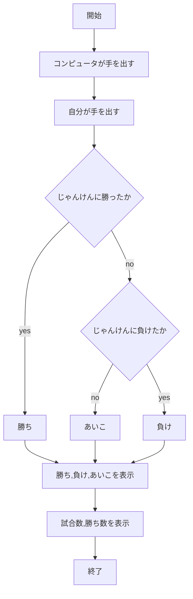

# webpro_06
##　このプログラムについて
このプログラムには,主に乱数を用いておみくじを引いたり,じゃんけんをしたりするプログラムapp5.jsがある
## ファイル一覧

```javascript
app.js
app2.js
spp3.js
app4.js
app5.js
```
## app5.js

```mermaid
flowchart TD;

start["開始"];
end1["終了"]
cpu["コンピュータが手を出す"]
rps["自分が手を出す"]
if{"じゃんけんに勝ったか"}
win["勝ち"]
if2{"じゃんけんに負けたか"}
aiko["あいこ"]
loose["負け"]
print[勝ち,負け,あいこを表示]
total[試合数,勝ち数を表示]

start --> cpu
cpu --> rps
rps --> if
if -->|yes| win
win --> print
if -->|no| if2
if2 --> |yes| loose
if2 --> |no| aiko
aiko-->print
loose --> print
print --> total
total --> end1
```