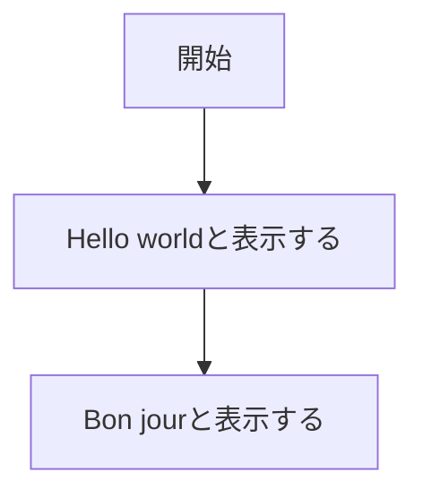
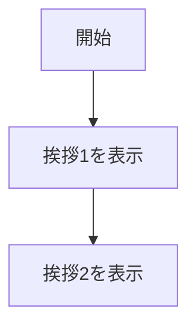
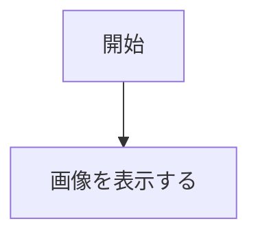
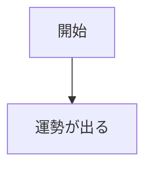
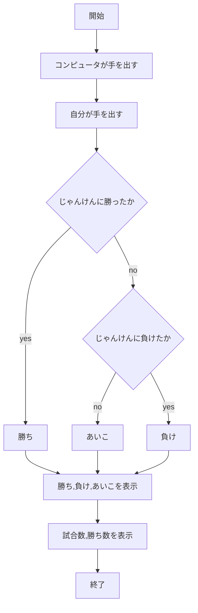
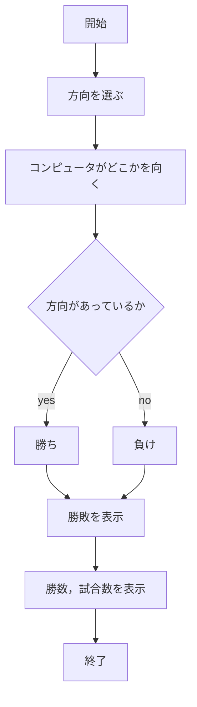
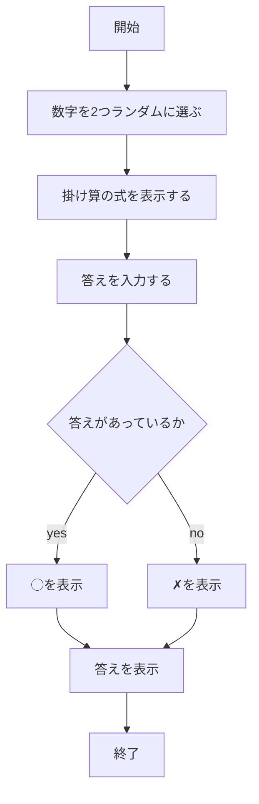

# webpro_06
##　このプログラムについて
app5.jsには，挨拶をする機能，画像を表示する機能，運勢を占う機能，じゃんけんをする機能，あっち向いてホイをする機能，計算の問題を出す機能がある．
## 機能一覧
```javascript
/hello1
/hello2
/icon
/luck
/janken
/lot
/math-game
```
## 機能の説明
### /hello1

この機能は挨拶を2つ設定し，それを表示するものである．今回は，Hello worldとBon jourが設定してある．

### /hello2

この機能も挨拶を2つ表示するものである．今回は，Hello worldとBon jourが設定してある．

### /icon

この機能は，用意した画像のURLからその画像を表示するものである．

### /luck

この機能は，運勢を占うものである．開始するとランダムに運勢が表示される．

### /janken


この機能は，じゃんけんをするものである．開始して，グーかチョキ，パーを入力しコンピュータにかつと勝数が増える．また，トータルの試合数も記録する．

### /lot


この機能は，あっち向いてホイをするものである．開始すると，方向を選ぶことができる．選んだ方向がコンピュータが向いた方向と同じであれば勝ち，そうでなければ負け，と表示される．また，勝数と試合数を数えて表示する．

### /math-game

この機能は，２つの2桁の数字を表示してその積を回答し，答えがあっているかを判断するものである．あっていれば◯，間違っていれば✗を表示する．

## 機能使用方法
まず，node app5.jsとターミナルに入力し起動する．そして，ターミナルの新しいウインドウを開きtelnet localhost 8080と入力し，
GET /luck HTTP/1.1
Host: localhost
 
と入力する．その後は下記の表に合わせて使用したい機能ごとにブラウザに入力する．
機能|ブラウザの入力
-|-
/hello1|http://localhost:8080/hello1
/hello2|http://localhost:8080/hello2
/icon|http://localhost:8080/icon
/luck|http://localhost:8080/luck
/janken|http://localhost:8080/janken
/lot|http://localhost:8080/lot
/math-game|http://localhost:8080/math-game